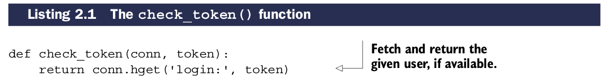
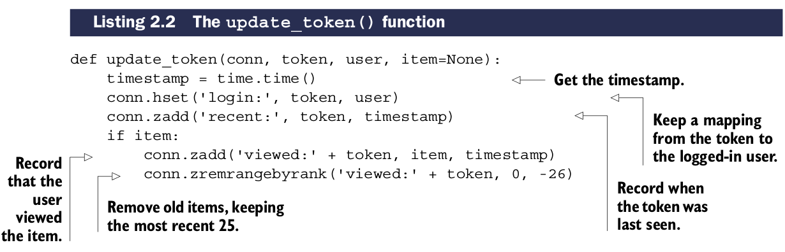
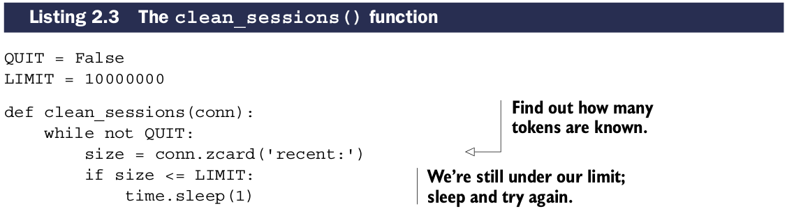
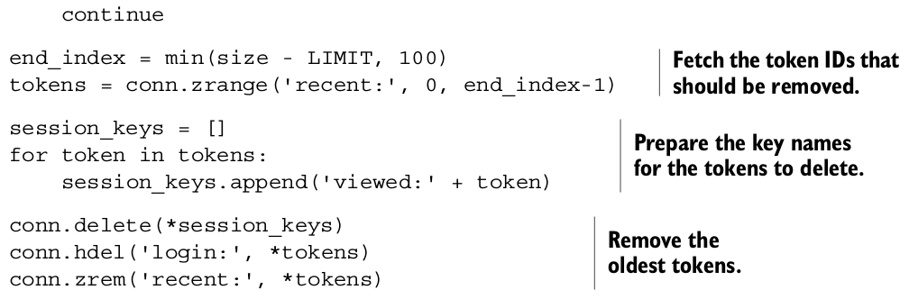

# 登录和cookie缓存

对于登录cookie,有两种常的方法存储登录信息： ``signed cookie``和``token cookie``

***Signed cookies***通常存储用户名，可能是最后登录的user ID。随着用户的访问，该cookie同样包含有一个签名信息用于服务器验证用户身份。

***Token cookies***使用一系列随机字节存储在cookie。在服务端，这个token用作用户的key，让服务端查找该用户是否有权限查询某些数据库中的数据。随着时间推移，旧的tokens可以被删除，腾出新的空间给新的token.

## signed cookies和token cookies优缺点对比

| Cookie type | Pros | Cons |
| --- | --- | --- |
| Signed cookie | 一切需要验证信息都在cookie。额外信息可以很容易附加进来 | 正确处理签名很难。容易忘记签名或认证数据，易引发安全漏洞 |
| Token cookie | 加入信息很容易。容量小，所以手机和速度慢的客户端可以快速发送数据 | 服务端需存储更多信息。如果使用关系型数据，cookie加载/存储开销很大 |

为了安全性考虑使用Token cookie，在高并发网站使用redis存储cookie，也是数据库调优的一部分。
范例中使用``HASH``存储用户的login cookie tokens映射。检测登录，需要基于token获取用户。

下面代码展示了这个验证登录cookie的过程:

对于访客，需要为当前用户的token更新login HASH并记录当前时间戳，使用``ZSET``记录。如果用户浏览了一个项目，我们同样加入该项目到用户的最近访问记录``ZSET``中，并且修订该``ZSET``当超过25个项目时。

下面代码展示了这个过程:

清理过期session的过程:

