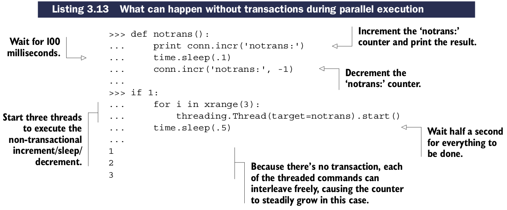
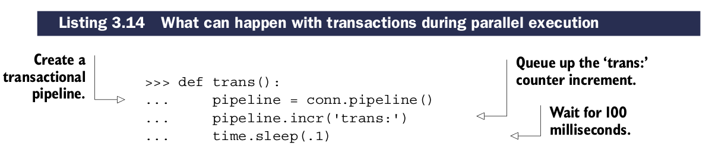
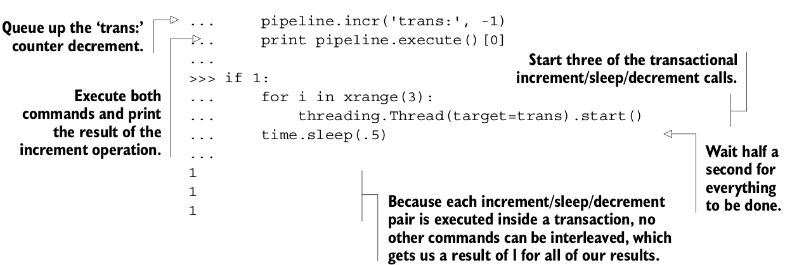

# Redis基本事务

有时候我们为了同时操作多种数据结构，需要多次调用命令在同一时刻。Redis有五种命令可以让我们不间断的操作多种keys: ``WATCH``,``MULTI``,``EXEC``,``UNWATCH``和``DISCARD``

## 在Redis中一个基本事务是什么?

在Redis中，一个基本事务包括``MULTI``和``EXEC``，意思是提供给客户端执行多个命令A,B,C,...的功能，其他客户端不能打断。这个和关系型数据库的可以部分执行，然后回滚或递交的事务不同。在Redis中，每个作为一个基本的``MULTI``/``EXEC``事务的一部分传递的命令，都将一个执行完执行下一个。在它们都执行完毕后，其客户端才可以执行自己的命令。

当看``MULTI``,Redis将会从相同的连接组建命令队列，直到它看到一个``EXEC``，才会不中断的执行整个命令队列。在语义上，Python类库处理事务使用一个叫``pipeline``的方法。在连接对象上调用``pipeline()``方法将会创建一个事务，正确的话将会自动使用``MULTI``和``EXEC``包装一个命令队列。Python Redis客户端也会存储命令，直到我们真正需要发送的时候才发送。这会减少Redis和客户端的交互次数，提高性能。

没有事务的话，每个线程都可以同时访问并修改数据库，下面的例子将展示范例。

