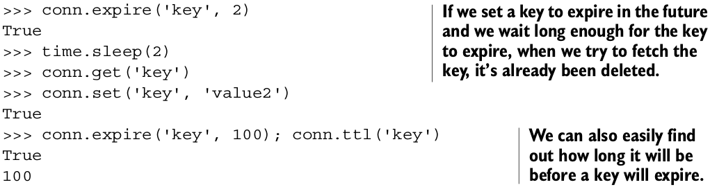

# 使keys过期

除了使用``DEL``删除数据之外，还可以指定过期时间，让Redis自动在超时之后删除。

## Redis中处理过期的命令

| 命令 | 用法示例和描述 |
| -- | -- |
| PERSIST | PERSIST key-name —— 从一个key中移除过期数据 |
| TTL | TTL key-name —— 返回一个key的到期剩余时间 |
| EXPIRE | EXPIRE key-name seconds —— 以秒为单位设置key的过期时间 |
| EXPIREAT | EXPIREAT key-name timestamp —— 以指定的Unix时间戳形式设置过期时间 |
| PTTL | PTTL key-name —— 以毫秒为单位返回key的到期剩余时间(Redis 2.6以后可用) |
| PEXPIRE | PEXPIRE key-name milliseconds —— 以毫秒为单位设置key的过期时间(Redis 2.6以后可用) |
| PEXPIREAT | PEXPIREAT key-name timestamp-milliseconds —— 同EXPIREAT，时间戳格式为毫秒(Redis 2.6以后可用) |

