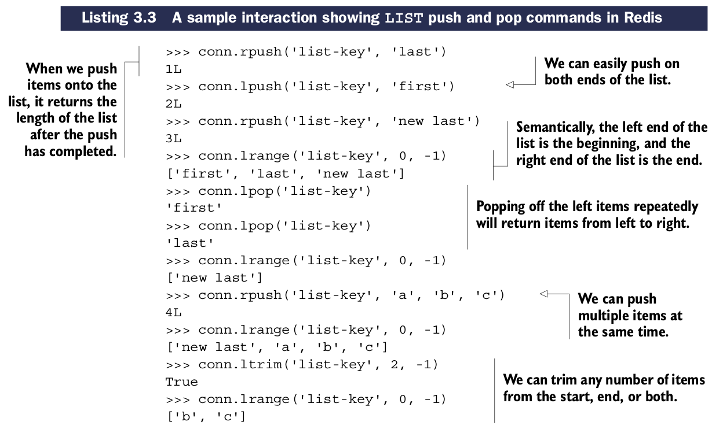
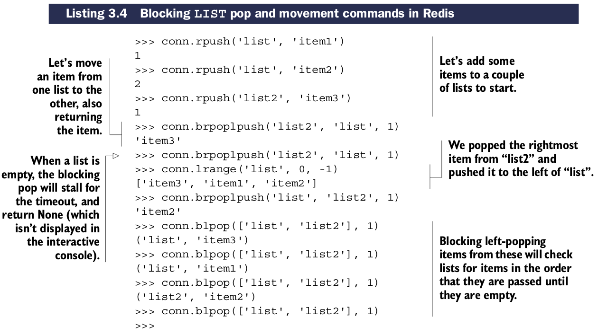

# Lists

本节介绍``LISTs``, ``LISTs``存储一个有序的``STRING``队列。

## 一些``LIST``常用命令

| 命令 | 用法示例和描述 |
| ---- | -------------- |
| RPUSH | RPUSH key-name value [value ...] —— 从list右侧压入数据 |
| LPUSH | LPUSH key-name value [value ...] —— 从list左侧压入数据 |
| RPOP | RPOP key-name —— 删除并返回list最右侧的项 |
| LPOP | LPOP key-name —— 删除并返回list最左侧的项 |
| LINDEX | LINDEX key-name offset —— 返回指定位置的项 |
| LRANGE | LRANGE key-name start end —— 返回指定起止范围内的项 |
| LTRIM | LTRIM key-name start end —— 截掉start到end之间的项 |

## 一些``LIST``阻塞式弹出和在``LISTs``之间移动itmes的命令

| 命令 | 用法示例和描述 |
| ---- | -------------- |
| BLPOP | BLPOP key-name [key-name] timeout —— 弹出首个非空``LIST``的最左侧的item，否则等待超时时间(单位: s) |
| BRPOP | BRPOP key-name [key-name ...] timeout —— 弹出首个非空``LIST``的最右侧的item，否则等待超时时间(单位: s) |
| RPOPLPUSH | RPOPLPUSH source-key dest-key —— 从source弹出最右侧的item并``LPUSHes``到destination,同时返回item给用户 |
| BRPOPLPUSH | BRPOPLPUSH source-key dest-key timeout —— 从source弹出最右侧的item并``LPUSHes``到destination,同时返回item给用户。如果source为空则等待超时(单位: s) |

关于英文书中原文对``blocking LIST pops``的解释比较绕口，不怎么会翻译，可以参考国内的资料，应该好理解了： http://redis.readthedocs.org/en/latest/list/blpop.html
http://redis.readthedocs.org/en/latest/list/brpoplpush.html

python操作范例：

``LISTs``一个主要的好处是可以包含多个相同的string值。``SETs``与之类似，但是``SET``中每个item是唯一的。
