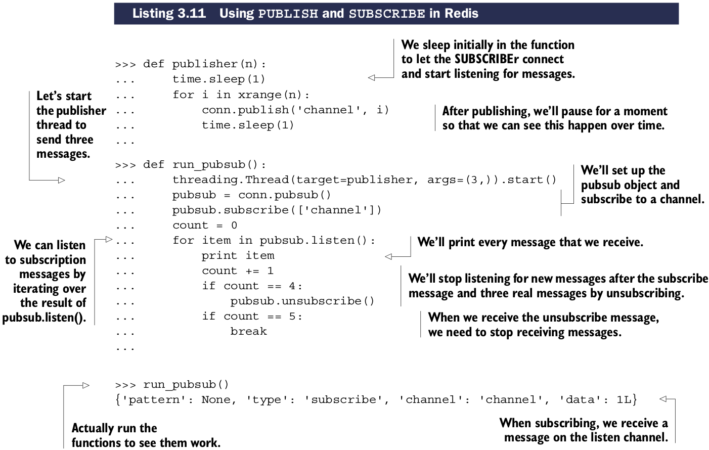
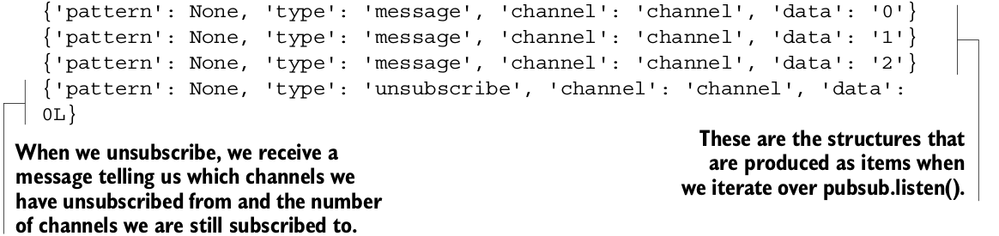

# Publish/subcribe(发布/订阅)

publish/subcribe(发布/订阅)通常也被称为pub/sub，特征是publishers发送二进制的消息到信道(channels)上，listeners从信道订阅(subcribing)消息。任何人监听指定信道都将会收到发送到该信道的所有信息。你可以认为就像电台一样，订阅者(subcribers)可以同时收听多个电台，发布者(publishers)可以把消息发送到任何一个电台。

本节讲讨论如何使用publish和subscribe功能。

## Redis中pub/sub处理命令

| 命令 | 用法示例和描述 |
| ---- | -------------- |
| SUBSCRIBE | SUBSCRIBE channel [channel ...] —— 订阅指定信道 |
| UNSUBSCRIBE | UNSUBSCRIBE [channel [channel ...]] —— 取消订阅指定信道，如果未指定channel则取消订阅所有信道 |
| PUBLISH | PUBLISH channel message —— 发布消息到指定信道 |
| PSUBSCRIBE | PSUBSCRIBE pattern [pattern] —— 发送消息广播到所有匹配给定模式的信道 |
| PUNSUBSCRIBE | PSUBSCRIBE pattern [pattern ...] —— 从匹配给定模式的信道中订阅消息广播 |

使用``PUBLISH``和``SUBSCRIBE``命令在Python中的实现形式，很容易在辅助线程展示``PUBLISH``ing的特性。

``PUBLISH``和``SUBSCRIBE``很有用，但是却不常用，有两个原因
* 第一个原因是Redis的系统可靠性问题。在老版本的Redis中，一个客户端从信道订阅消息，但是读取消息的速度不够快时，将会导致Redis自身维持一个非常大的输出缓冲区。如果这个缓冲区太大，将会导致Redis性能急剧下降甚至崩溃。现在版本的Redis没有这个问题，当超过``pubsub``配置选项中的``client-output-buffer-limit``时会断开订阅的客户端。
* 第二个原因是数据传输可靠性。在任何形式的网络系统中，你必须在假想你的操作在某一点会失败的前提下操作。通常的会在一段处理或重连。Python Redis客户端将会通过重连自动处理连接失败问题。但是在某些情况下订阅异常断开，订阅的消息在重连之前就发送了，客户端将永远无法收到这消息。当你依赖一条信道接受消息，Redis的``PUBLISH/SUBSCRIBE``语义可能会令你失望。

