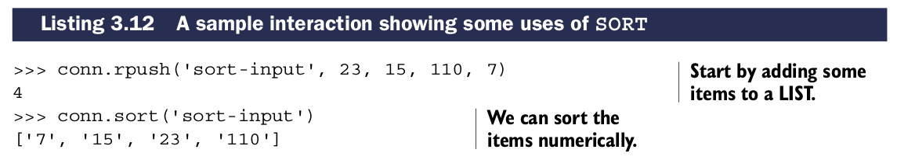
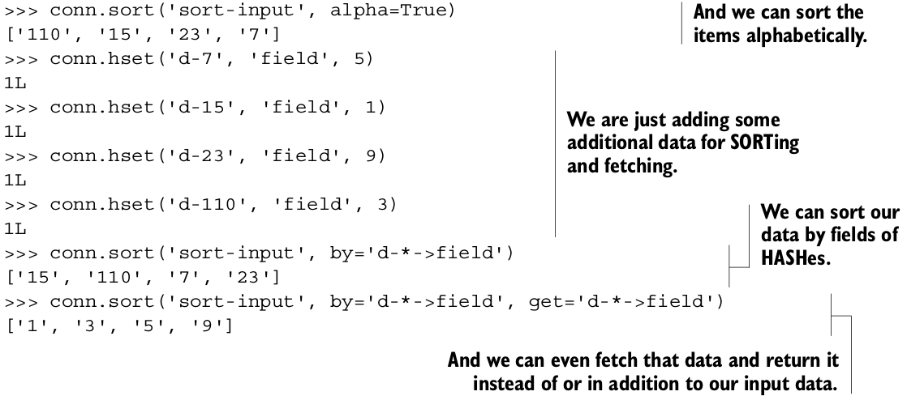

# Sorting

Sorting在Redis中和其他语言中功能类似。用于按照某种规则排序元素。``SORT``允许排序``LISTs``,``SETs``和``ZSETs``,也包括``HASHes``。如果你从关系型数据库转过来，你可以认为``SORT``和``order by``功能一样。

## SORT命令定义

| 命令 | 用法示例和描述 |
| -- | -- |
| SORT | SORT source-key [BY pattern] [LIMIT offset count] [GET pattern [GET pattern ...]] [ASC&#124;DESC] [ALPHA] [STORE dest-key] —— 按照提供选项排序``LIST``,``SET``或``ZSET``，并返回或存储结果 |

