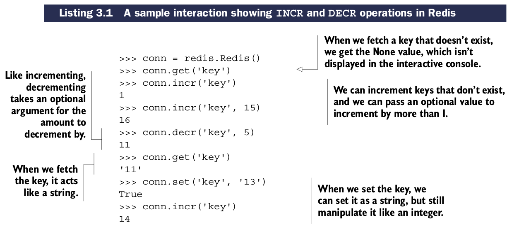

# Strings

在Redis中，``STRINGs``可以用于存储以下三种类型数据:

* 字节字符串
* 整型
* 浮点型

整型和浮点型可以按照任意数值递增或递减(整型可以按需转换为浮点型)。整型范围等同于平台的长整型(long integer)范围(在32-bit平台上有符号整型是32-bit,在64-bit平台上有符号整型是64-bit)。floats可用范围和限制依照IEEE 754 floating-point doubles.

整型，浮点型的``STRINGs``可以使用递增/递减操作

## Redis中递增递减操作

| 命令 | 用法示例和描述 |
| -- | -- |
| INCR | INCR key-name —— 使key存储的值加1 |
| DECR | DECR key-name —— 使key存储的值减1 |
| INCRBY | INCRBY key-name amount —— 使key存储的值增加给定的整数 |
| DECRBY | DECRBY key-name amount —— 使key存储的值减少给定的整数 |
| INCRBYFLOAT | INCRBYFLOAT key-name amount —— 使key存储的值增加给定的浮点数(Redis 2.6以上可用) |

Redis还额外提供字符串的操作方法。

## Redis可用的字符串操作命令

| 命令 | 用法示例和描述 |
| -- | -- |
| APPEND | APPEND key-name value —— 使key存储的字符串追加给定的值 |
| GETRANGE | GETRANGE key-name start end —— 获取从start到end的所包含的子字符串 |
| SETRANGE | SETRANGE key-name offset value —— 使子字符串从给定位置开始覆盖为给定值 |
| GETBIT | GETBIT key-name offset —— 将字节串作为比特串处理，并返回字符串中给定比特偏移量的比特值 |
| SETBIT | SETBIT key-name offset value —— 将字节串作为比特串处理，设置指定比特偏移量的值为给定比特 |
| BITCOUNT | BITCOUNT key-name [start end] —— 统计字符串中比特值为1的数量，可选参数为起始和结束位 |
| BITOP | BITOP operation dest-key key-name [key-name ...] —— 在提供的字符串执行一个位操作运算，AND, OR, XOR,或NOT, 存储结果到目标key |

**GETRANGE AND SUBSTR**: 在过去，``GETRANGE``被命名为``SUBSTR``, Python客户端依旧沿用``substr()``方法获取字符串的子串。当Redis版本高于2.6时，应该使用``getrange()``方法，低于2.6版本使用``substr()``方法。

