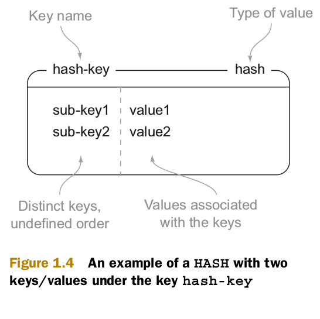
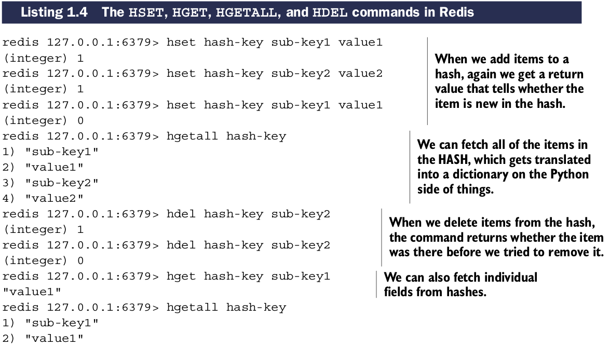

# Redis的Hashes类型

不同于``LISTs``和``SETs``存储items的队列，``HASHes``存储一组键到值的映射(map)。能被存储到``HASHes``的值和``STRINGs``的值相同，字符串本身，或者数值。

多数情况，我们可以把``HASHes``想象成一个微型版本的Redis自身。一些``STRINGs``的命令同样可以执行。

## HASH类型可使用的命令

| 命令 | 作用 |
| ---- | ---- |
| HSET | 存储键值到hash |
| HGET | 获取指hash key的值 |
| HGETALL | 获取整个hash |
| HDEL | 从hash删除一个key |

对于熟悉文档存储或关系型数据的人来说，我们可以认为Redis ``HASH``类型类似文档存储中的``document``, 关系型数据库中的``row``。
