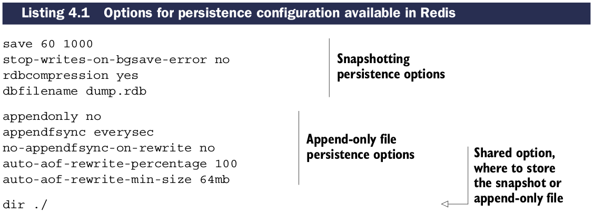

# 持久性配置选项

Redis内部有两种不同的方式将数据持久保存到硬盘。

* **快照(*snapshotting*)**: 将某一时刻数据原样保存到硬盘。
* **AOF(append-only file)**: 原理是当发生写入命令时，拷贝即将执行的写命令到硬盘。

这些方法可以单独使用，也可以联合使用，或者在某些情况下都不用。选择哪种取决于你的数据和你的应用程序。

## 持久性配置选项

第一组配置基本的快照选项，像是存储的快照名，自动存储快照的频率，是否压缩快照，以及是否在失败时继续接受写入操作。

第二组配置AOF子系统，告诉Redis是否启用，同步写硬盘的频率，在AOF压缩时是否同步。
