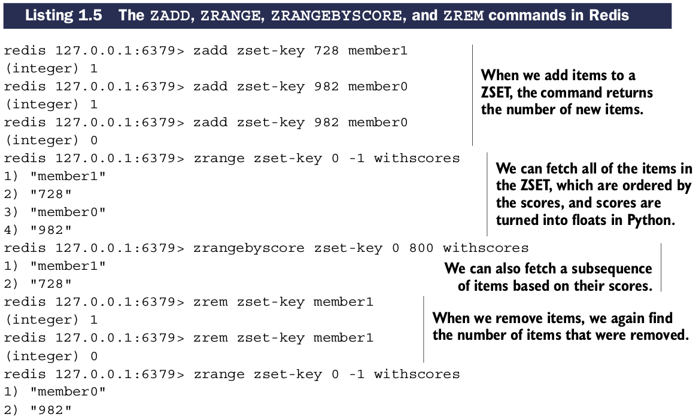

# Redis的Sorted sets类型

像``HASHes``一样，``ZSETs``同样保存一种键值对类型。keys(称为成员(*members*))是唯一的，values(称为分值(*scores*))限定只能是浮点数。``ZSETs`` 在Redis中具有唯一属性可被成员访问(像一个HASH)，同样items可以通过score排序或访问。

## ZSET类型可用命令

| 命令 | 作用 |
| -- | -- |
| ZADD | 加入成员以及对应的分值到ZSET |
| ZRANGE | 以顺序次序从给定位置范围获取ZSET的项 |
| ZRANGEBYSCORE | 基于分值范围获取ZSET中的项 |
| ZREM | 删除ZSET中的项 |

